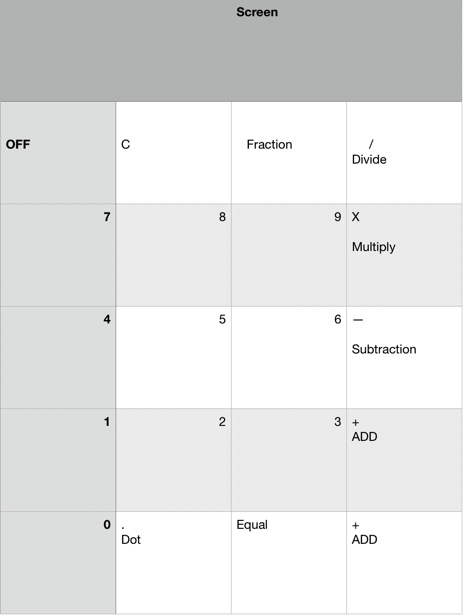

# Create a Calculator

## Purpose Statement
For the user to enter in two or more numbers to either add, subtract, multiply or divide to get a result number.

## High level features / user stories
As a user, I want either add, subtract, multiply or divide two or more numbers so that a user can see the result number.

## Detailed sketches

##

